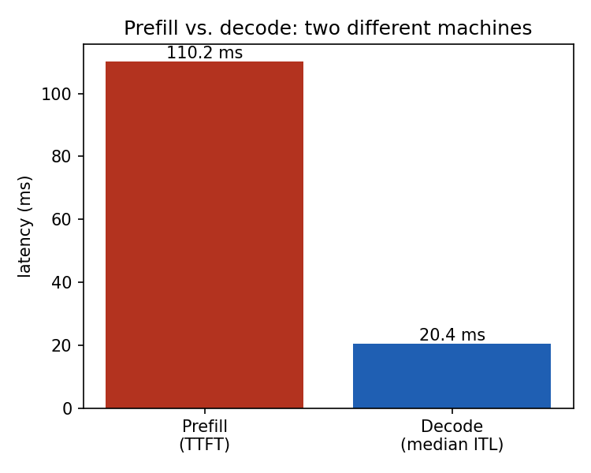
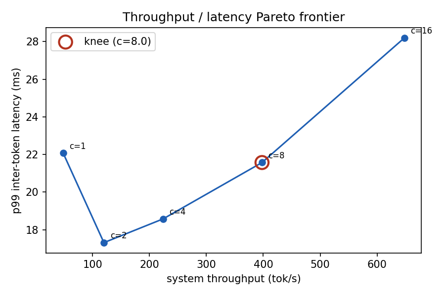
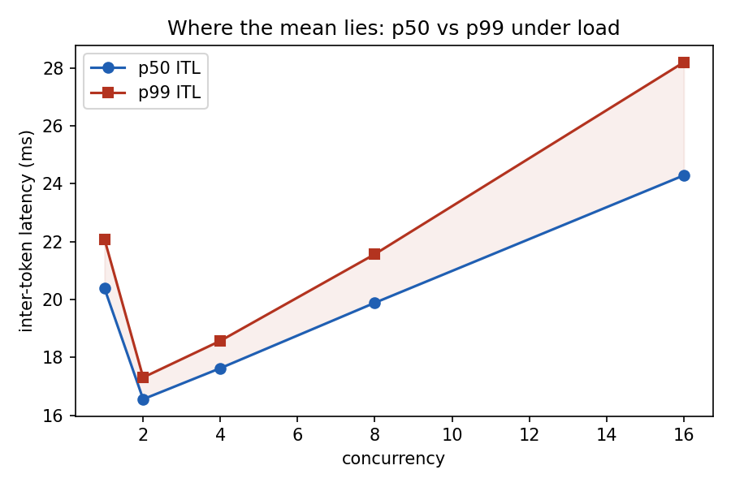

# DecodeBound

**A reproducible harness for characterizing LLM *serving* performance.**

Decompose inference into compute-bound prefill and memory-bound decode, map the
throughput / latency Pareto frontier, and treat latency as a *distribution* — not a single
averaged number that hides the tail.

`vLLM` · `continuous batching` · `Python` · roofline-oriented profiling

---

> ⚠️ **Status / honesty note.** The numbers in this README are **illustrative placeholders**
> from the project design. Replace each one with output from your own runs (`./reproduce.sh`)
> before sharing. A result without its `run_meta.json` is not a result.

---

## The finding in one sentence

> Past the knee of the concurrency sweep, system throughput gains **~5%** while **p99**
> inter-token latency degrades **4.4×** (110 ms → 480 ms). The mean hides it; the distribution doesn't.

That sentence — and the methodology that earns it — is the whole project.

## What this is (and isn't)

This **is** a measurement instrument: it runs a real serving stack, sweeps the knobs that
matter, and characterizes the result with enough statistical care that the numbers survive
scrutiny. It does **not** train models, serve production traffic, or reinvent the load
generator — it builds an analysis layer on top of vLLM's serving benchmark.

Three questions it answers:

1. Where does inference time actually go — prefill or decode?
2. What's the real throughput/latency tradeoff, and where's the honest operating point?
3. How badly does the tail degrade under load, and *why*?

---

## 1 · Prefill vs. decode: two different machines

Inference has two phases with opposite hardware profiles. Prefill processes the whole prompt
at once and **saturates the GPU** (compute-bound, high arithmetic intensity). Decode emits one
token at a time and **leaves the GPU mostly idle**, gated by memory bandwidth. Optimizing
inference is mostly optimizing decode.

| Phase   | Metric              | Value*  | SM utilization* | Roofline regime              |
|---------|---------------------|---------|-----------------|------------------------------|
| Prefill | TTFT (512-tok prompt) | 62 ms   | 94%             | compute-bound                |
| Decode  | ITL (per token)     | 21 ms   | 34%             | memory-bandwidth-bound       |

<sub>*illustrative placeholders — replace with measured values.</sub>

The low decode utilization is the measured evidence for the memory-bound claim, not an assertion.



---

## 2 · The throughput / latency Pareto frontier

Sweeping concurrency traces the frontier every deployment negotiates. Throughput saturates
long before latency does — so the **knee** is the honest operating point. Everything to the
right buys throughput with tail latency.

| Concurrency | Throughput (tok/s)* | p50 ITL (ms)* | p99 ITL (ms)* |
|------------:|--------------------:|--------------:|--------------:|
| 1           | 48                  | 21            | 24            |
| 4           | 175                 | 24            | 35            |
| 8           | 320                 | 28            | 55            |
| **16 (knee)** | **520**           | **38**        | **110**       |
| 32          | 610                 | 62            | 240           |
| 48          | 638                 | 95            | 480           |

<sub>*illustrative placeholders.</sub>



---

## 3 · Where the mean lies: p50 vs. p99 under load

The signature result. As concurrency rises, the **median barely moves** — so an averaged
benchmark reports "fine." Meanwhile **p99 detaches and climbs an order of magnitude**. Reporting
a single number would have erased a 4.4× tail-latency regression.



---

## Methodology — why one number lies

The credibility *is* the product. This harness refuses to report a single averaged latency.

- **Full distribution, always.** Every latency figure carries p50 / p95 / p99.
- **Automatic warmup detection.** Warmup is found via a rolling-stability test and discarded —
  never eyeballed, never a hardcoded "drop first N."
- **Latency is correlated, not i.i.d.** Consecutive request latencies are coupled through
  KV-cache occupancy and scheduler state. The harness measures the **autocorrelation** between
  successive requests and explains it, rather than pretending samples are independent.
- **Convergence window.** An Allan-variance-style check reports the number of requests at which
  measured throughput actually stabilizes — so the run length is justified, not arbitrary.
- **Utilization recorded alongside latency**, so the roofline claims are measured.

This methodology comes from a background in stochastic-process characterization (state
estimation / Allan-variance analysis), applied here to inference serving.

---

## Reproduce

```bash
# 1. set your target in AGENTS.md (model, GPU, VRAM), then:
pip install -e .

# 2. regenerate every committed result and figure
./reproduce.sh --model llama-3.1-8b --backend vllm --sweep concurrency
```

Each run writes per-request data to `results/raw/` plus a `run_meta.json` capturing model,
dtype, vLLM version, GPU, driver, and workload. Aggregates and figures are *derived* from raw
data, never hand-edited.

> Requires an NVIDIA GPU. On a Mac / no GPU, rent a cloud instance — only the backend changes.

---

## Repo layout

```
decodebound/
├── AGENTS.md            instructions for coding agents
├── harness/             server launch · workloads · concurrency sweep
├── analysis/            stats (percentiles, ACF, warmup, convergence) · decompose · plots
├── results/             raw per-request data + figures (committed)
└── report.md            longer write-up
```

---

## Scope and honest limitations

Single-node, single-model characterization on one GPU. It does not cover multi-node /
disaggregated serving or kernel-level optimization — those are the natural next steps. Numbers
are specific to the configuration in `run_meta.json` and don't generalize across hardware.

---

<sub>Built as a study in inference performance methodology. Measurement first; the number is only as good as how it was taken.</sub>
